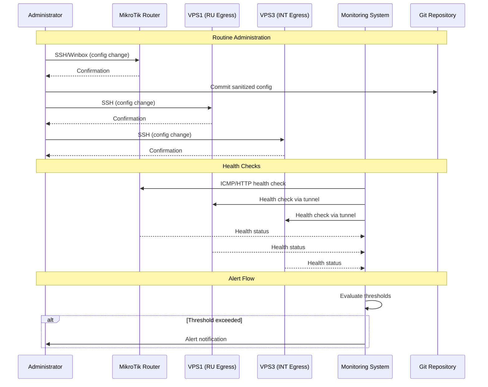

# Administration Flow

```mermaid
sequenceDiagram
    participant Admin as Administrator
    participant Router as MikroTik Router
    participant VPS1 as VPS1 (RU Egress)
    participant VPS3 as VPS3 (INT Egress)
    participant Monitor as Monitoring System
    participant Git as Git Repository

    Note over Admin,Git: Routine Administration
    Admin->>Router: SSH/Winbox (config change)
    Router-->>Admin: Confirmation
    Admin->>Git: Commit sanitized config
    Admin->>VPS1: SSH (config change)
    VPS1-->>Admin: Confirmation
    Admin->>VPS3: SSH (config change)
    VPS3-->>Admin: Confirmation

    Note over Admin,Git: Health Checks
    Monitor->>Router: ICMP/HTTP health check
    Monitor->>VPS1: Health check via tunnel
    Monitor->>VPS3: Health check via tunnel
    Router-->>Monitor: Health status
    VPS1-->>Monitor: Health status
    VPS3-->>Monitor: Health status

    Note over Admin,Git: Alert Flow
    Monitor->>Monitor: Evaluate thresholds
    alt Threshold exceeded
        Monitor->>Admin: Alert notification
    end
```
