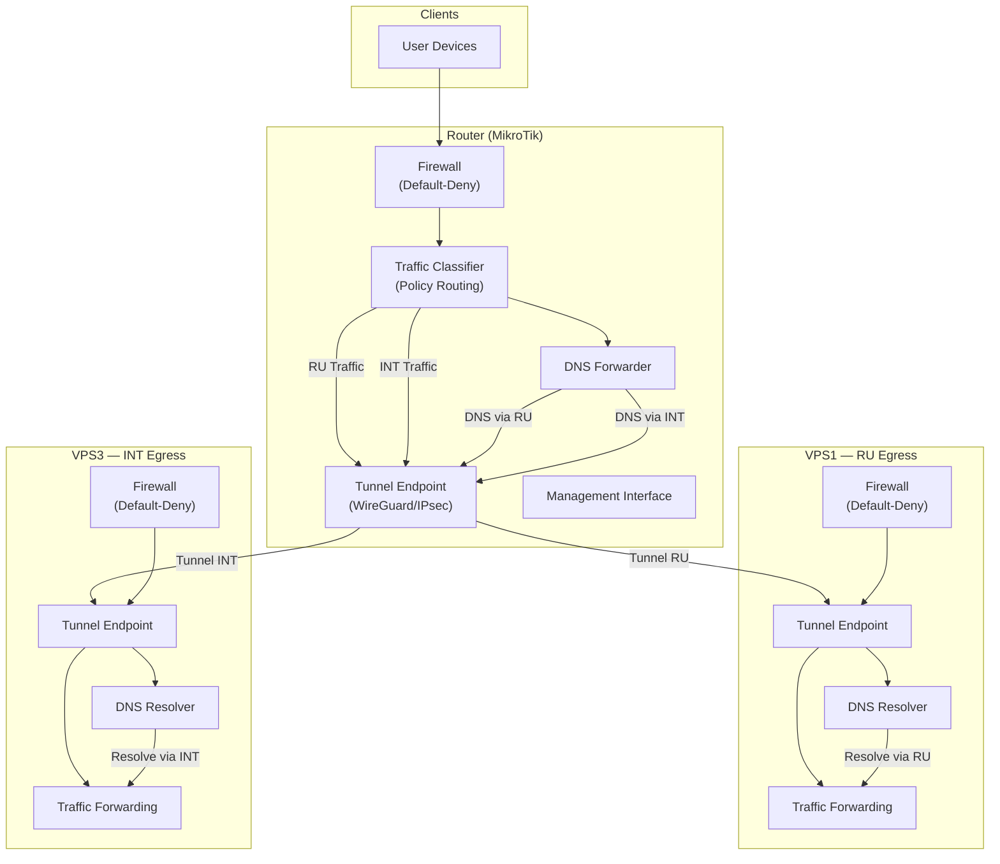

# Container Diagram

```mermaid
graph TB
    subgraph Clients["Clients"]
        C1["User Devices"]
    end

    subgraph Router["Router (MikroTik)"]
        FW["Firewall<br/>(Default-Deny)"]
        CLASS["Traffic Classifier<br/>(Policy Routing)"]
        TUN_R["Tunnel Endpoint<br/>(WireGuard/IPsec)"]
        DNS_R["DNS Forwarder"]
        MGMT_R["Management Interface"]
    end

    subgraph VPS1["VPS1 — RU Egress"]
        TUN_1["Tunnel Endpoint"]
        FW_1["Firewall<br/>(Default-Deny)"]
        DNS_1["DNS Resolver"]
        EGRESS_1["Traffic Forwarding"]
    end

    subgraph VPS3["VPS3 — INT Egress"]
        TUN_3["Tunnel Endpoint"]
        FW_3["Firewall<br/>(Default-Deny)"]
        DNS_3["DNS Resolver"]
        EGRESS_3["Traffic Forwarding"]
    end

    C1 --> FW
    FW --> CLASS
    CLASS -->|"RU Traffic"| TUN_R
    CLASS -->|"INT Traffic"| TUN_R
    CLASS --> DNS_R

    TUN_R -->|"Tunnel RU"| TUN_1
    TUN_R -->|"Tunnel INT"| TUN_3

    DNS_R -->|"DNS via RU"| TUN_R
    DNS_R -->|"DNS via INT"| TUN_R

    TUN_1 --> DNS_1
    TUN_1 --> EGRESS_1
    DNS_1 -->|"Resolve via RU"| EGRESS_1

    TUN_3 --> DNS_3
    TUN_3 --> EGRESS_3
    DNS_3 -->|"Resolve via INT"| EGRESS_3

    FW_1 --> TUN_1
    FW_3 --> TUN_3
```
