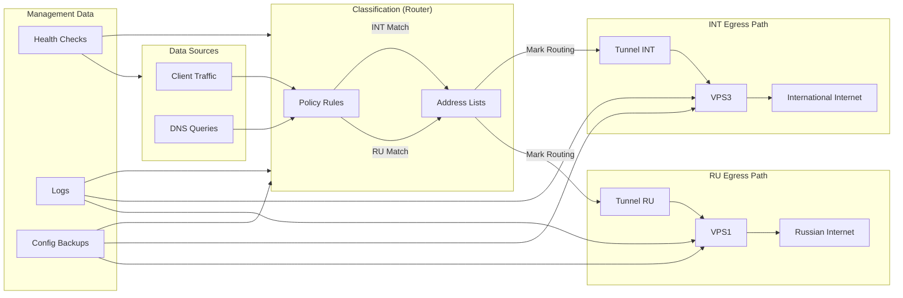

# Data Flow

```mermaid
graph LR
    subgraph Sources["Data Sources"]
        Client["Client Traffic"]
        DNS_Q["DNS Queries"]
    end

    subgraph Classification["Classification (Router)"]
        Rules["Policy Rules"]
        ALists["Address Lists"]
    end

    subgraph RU_Path["RU Egress Path"]
        TUN_RU["Tunnel RU"]
        VPS1["VPS1"]
        RU_Internet["Russian Internet"]
    end

    subgraph INT_Path["INT Egress Path"]
        TUN_INT["Tunnel INT"]
        VPS3["VPS3"]
        INT_Internet["International Internet"]
    end

    subgraph Mgmt["Management Data"]
        Health["Health Checks"]
        Logs["Logs"]
        Backup["Config Backups"]
    end

    Client --> Rules
    DNS_Q --> Rules
    Rules -->|"RU Match"| ALists
    Rules -->|"INT Match"| ALists
    ALists -->|"Mark Routing"| TUN_RU
    ALists -->|"Mark Routing"| TUN_INT
    TUN_RU --> VPS1 --> RU_Internet
    TUN_INT --> VPS3 --> INT_Internet

    Health --> Sources
    Health --> Classification
    Logs --> Classification
    Logs --> VPS1
    Logs --> VPS3
    Backup --> Classification
    Backup --> VPS1
    Backup --> VPS3
```
