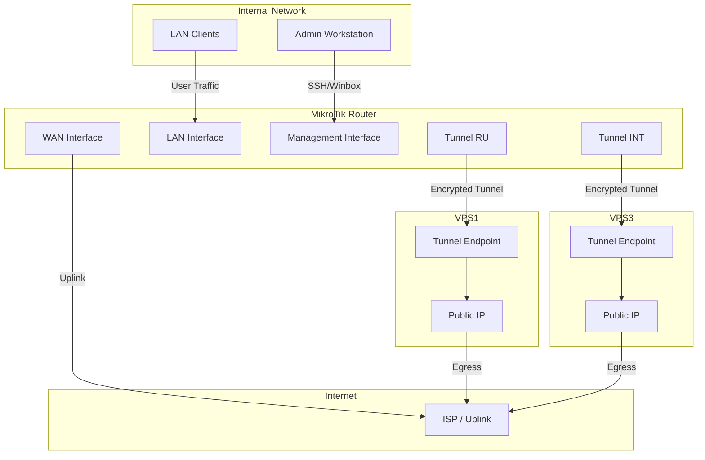

# Network Topology

```mermaid
graph TB
    subgraph Internet["Internet"]
        ISP["ISP / Uplink"]
    end

    subgraph LAN["Internal Network"]
        LAN_NET["LAN Clients<br/><INTERNAL_SUBNET_A>"]
        ADMIN_NET["Admin Workstation"]
    end

    subgraph Router_Box["MikroTik Router"]
        WAN_IF["WAN Interface<br/><ROUTER_WAN_IP>"]
        LAN_IF["LAN Interface"]
        MGMT_IF["Management Interface"]
        TUN_RU["Tunnel RU<br/><TUNNEL_RU_SUBNET>"]
        TUN_INT["Tunnel INT<br/><TUNNEL_INT_SUBNET>"]
    end

    subgraph VPS1_Box["VPS1"]
        VPS1_PUB["Public IP<br/><VPS1_PUBLIC_IP>"]
        VPS1_TUN["Tunnel Endpoint"]
    end

    subgraph VPS3_Box["VPS3"]
        VPS3_PUB["Public IP<br/><VPS3_PUBLIC_IP>"]
        VPS3_TUN["Tunnel Endpoint"]
    end

    LAN_NET -->|"User Traffic"| LAN_IF
    ADMIN_NET -->|"SSH/Winbox"| MGMT_IF
    WAN_IF -->|"Uplink"| ISP
    TUN_RU -->|"Encrypted Tunnel"| VPS1_TUN
    TUN_INT -->|"Encrypted Tunnel"| VPS3_TUN
    VPS1_TUN --> VPS1_PUB
    VPS3_TUN --> VPS3_PUB
    VPS1_PUB -->|"Egress"| ISP
    VPS3_PUB -->|"Egress"| ISP
```
