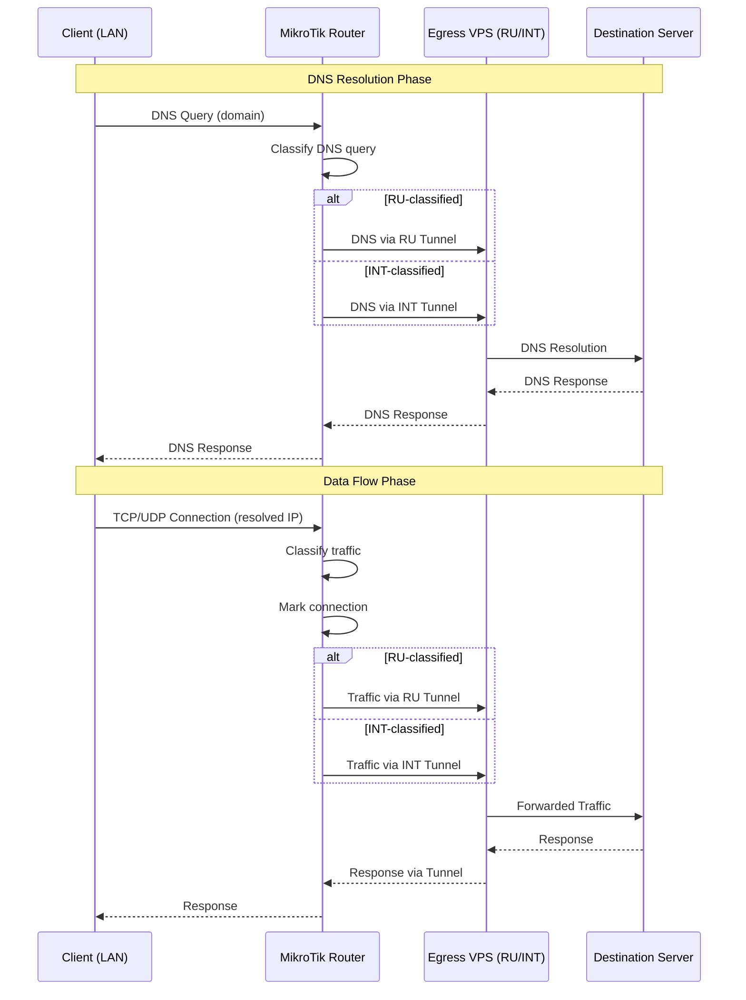

# Request Flow

```mermaid
sequenceDiagram
    participant Client as Client (LAN)
    participant Router as MikroTik Router
    participant VPS as Egress VPS (RU/INT)
    participant Dest as Destination Server

    Note over Client,Dest: DNS Resolution Phase
    Client->>Router: DNS Query (domain)
    Router->>Router: Classify DNS query
    alt RU-classified
        Router->>VPS: DNS via RU Tunnel
    else INT-classified
        Router->>VPS: DNS via INT Tunnel
    end
    VPS->>Dest: DNS Resolution
    Dest-->>VPS: DNS Response
    VPS-->>Router: DNS Response
    Router-->>Client: DNS Response

    Note over Client,Dest: Data Flow Phase
    Client->>Router: TCP/UDP Connection (resolved IP)
    Router->>Router: Classify traffic
    Router->>Router: Mark connection
    alt RU-classified
        Router->>VPS: Traffic via RU Tunnel
    else INT-classified
        Router->>VPS: Traffic via INT Tunnel
    end
    VPS->>Dest: Forwarded Traffic
    Dest-->>VPS: Response
    VPS-->>Router: Response via Tunnel
    Router-->>Client: Response
```
