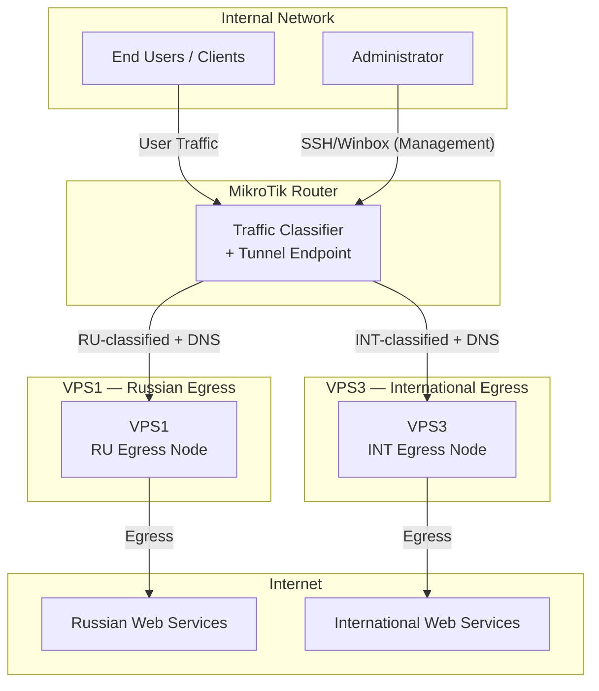

# System Context Diagram

```mermaid
graph TB
    subgraph Internet["Internet"]
        RU_Sites["Russian Web Services"]
        INT_Sites["International Web Services"]
    end

    subgraph Internal["Internal Network"]
        Clients["End Users / Clients"]
        Admin["Administrator"]
    end

    subgraph VPS1_Node["VPS1 — Russian Egress"]
        VPS1["VPS1<br/>RU Egress Node"]
    end

    subgraph VPS3_Node["VPS3 — International Egress"]
        VPS3["VPS3<br/>INT Egress Node"]
    end

    subgraph Router_Node["MikroTik Router"]
        Router["Traffic Classifier<br/>+ Tunnel Endpoint"]
    end

    Clients -->|"User Traffic"| Router
    Admin -->|"SSH/Winbox (Management)"| Router
    Router -->|"RU-classified + DNS"| VPS1
    Router -->|"INT-classified + DNS"| VPS3
    VPS1 -->|"Egress"| RU_Sites
    VPS3 -->|"Egress"| INT_Sites
```
