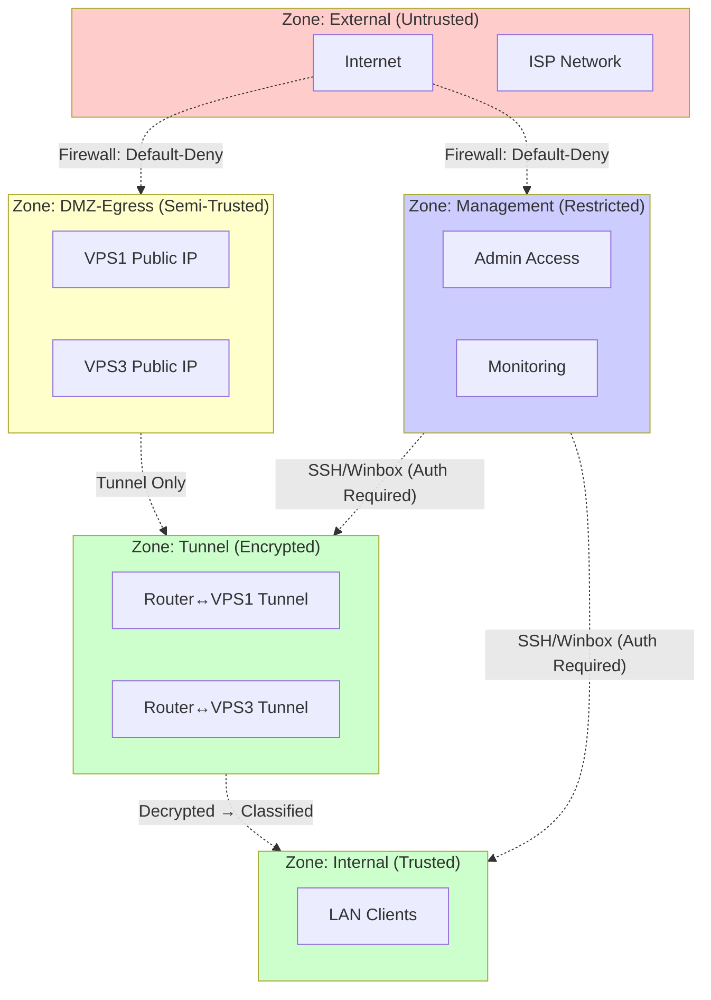

# Trust Boundaries

```mermaid
graph TB
    subgraph External["Zone: External (Untrusted)"]
        Internet["Internet"]
        ISP["ISP Network"]
    end

    subgraph DMZ["Zone: DMZ-Egress (Semi-Trusted)"]
        VPS1_Pub["VPS1 Public IP"]
        VPS3_Pub["VPS3 Public IP"]
    end

    subgraph Tunnel["Zone: Tunnel (Encrypted)"]
        TUN_RU["Router↔VPS1 Tunnel"]
        TUN_INT["Router↔VPS3 Tunnel"]
    end

    subgraph Internal["Zone: Internal (Trusted)"]
        LAN["LAN Clients"]
    end

    subgraph Management["Zone: Management (Restricted)"]
        Admin["Admin Access"]
        Monitor["Monitoring"]
    end

    Internet -.->|"Firewall: Default-Deny"| DMZ
    DMZ -.->|"Tunnel Only"| Tunnel
    Tunnel -.->|"Decrypted → Classified"| Internal
    Management -.->|"SSH/Winbox (Auth Required)"| Tunnel
    Management -.->|"SSH/Winbox (Auth Required)"| Internal
    Internet -.->|"Firewall: Default-Deny"| Management

    style External fill:#ffcccc
    style DMZ fill:#ffffcc
    style Tunnel fill:#ccffcc
    style Internal fill:#ccffcc
    style Management fill:#ccccff
```
